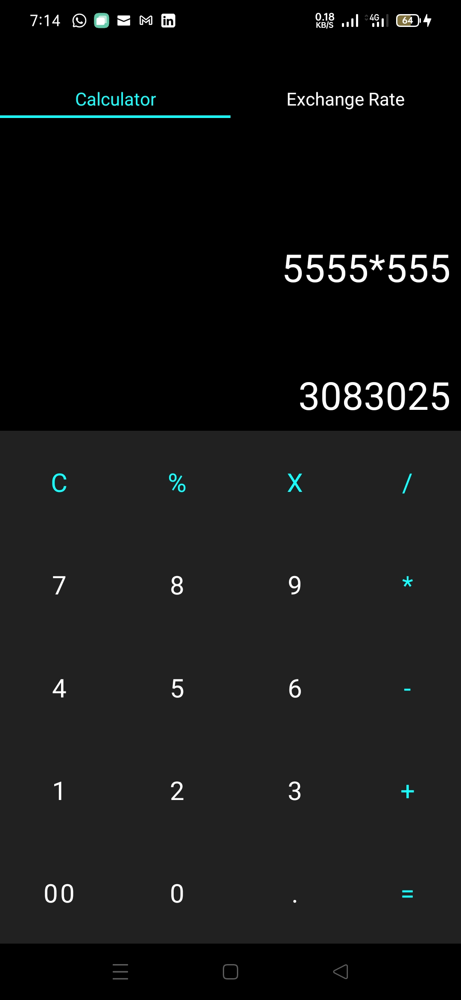

# currency-converter
A calculator and Currency onverter App made with Android Studio using Java.
It has 72 different currencies and fetches Current Exchange Rate values from a web API.
It also has a Light and Dark theme mode which activates either deending on the current theme
of the Android device.
# Screenshots

